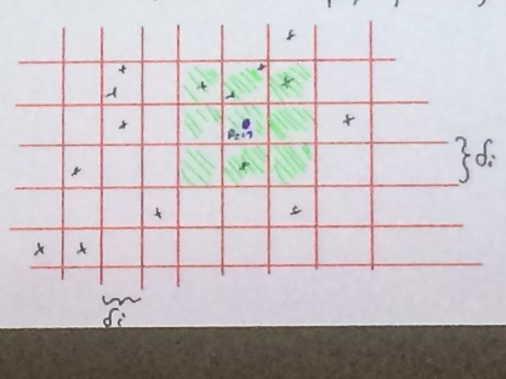

## 1. Vorlesung

## Hinweise
Fehlende  sind mit //TODO markiert.
## Randomisierte Algorithmen
Vergleich mit Kochrezept, manchmal zufällig 1 oder 2 Prisen Salz.
Abgrenzung zu deterministischen Algorithmen.

>Ein randomisierter Algorithmus ist ein ein Algorithmus,  welcher unter Nutzung einer Zufallsquelle (Münzwurf, Zufallszahlengenerator, ...) ein Problem löst:

Man könnte Algo dahingehend analysieren, wie viel Zufall er braucht.
Echter Zufall z.B. gemessenes physikalisches Rauschen.

>Oft sind RA (randomisierte Algorithmen) deutlich einfacher und teilweise auch effizienter als entsprechend deterministische Algorithmen.
Typischerweise analysiert man Algorithmen bzgl. Platz und Zeitbedarf, RA kann man auch bzgl. "verbrauch von Zufall" analysieren (machen wir wahrscheinlich nicht).

### Problem, Closest Pair
Gegeben: $n$ Punkte in $\mathbb{R}^2$

%%TODO Bild einfügen

Gesucht: $P1, P2 \in$ P mit $|p_1 p_1 |$ minimal

**Naive Lösungsidee:**

* Betrachte $p_1$ und berechne Distanz zu $p_1, ...., p_n$ merke Minimum
* Betrachte $p_2$ und berechne Distanz zu $p_3, ...., p_n$
* ...
* Betrachte $p_{n-1}$ und berechne Distanz zu $p_n$
* Gebe Minimum aller gemessenen Distanzen aus.
**Aufwand:** # gemessene Distanz

$p_1$ bzgl $n-1$; etc
$={n-1} + {n-2} + {n-3} ...  1$
$= \sum i = \tfrac{\tfrac{n-1}{n}}{2} = \mathcal{O}(n^2)$

#### Beispiel
CPU mit 1 Ghz, $10^9$ Instruktionen/Sekunde
Ab welchem $n^2$ Instruktionen für Eingabe der Größen braucht, läuft für
$n = 100 \rightarrow (100)^1 \cdot 10^{-9}= 10^{-5}$
$\Rightarrow$  10 Mikrosekunden
$n = 1000  \rightarrow (1000)^1 \cdot 10^{-9}= 10^{-3}$
$\Rightarrow$ 1 Millisekunde
$n = 100000  \rightarrow (100000)^1 \cdot 10^{-9}= 10$
$\Rightarrow$ 10 Sekunden
$n = 1000000  \rightarrow (1000000)^1 \cdot 10^{-9}= 10^3$
$\Rightarrow$ 1000 Sekunden

CP kann deterministisch in $\mathcal{O}($ log $n)$ Zeit gelöst werden. Man kann sogar beweisen, dass CP vergleichsbasiert nicht schneller als $\Omega(n$ log $n)$.

#### Jetzt: RA der Closest Pair in erwartet $\mathcal{O}(n)$ Zeit löst.

_%%FEHLER IN ABSATZ_

Wir entwerfe einen Alg., dessen Laufzeit als Zufallsvariable $X$ dargestallt werden kann.
Bei Eingangsgröße $n$ gilt $E(X)$ = $\mathcal{O} (n)$

### Ein inkrementeller Algorithmus für CP
Betrachten Punkte in Reihenfolge
$p_1, p_2, p_3, ... , p_n$
Sei $\delta_i$ die CP-Distanz der Punktmenge $\{p_1, p_2, ..., p_i\}$.
Angenommen mit $\delta_i$, wie

_%TODO TEXTFEHLT_

Naiv: Vergleiche $p_{i+1}$ mit $p_1$, $p_2$, ... $p_i$
und setze $\delta_i = min(\delta_i, min (p_{i+1} p_{\delta})$)

$\rightarrow$ Gesamt ($\delta_z$ wieder (1+2+...+n-1)) = $\mathcal{O} (n^2)$

Verbesserung: Angenommen wir haben $\delta_i$ bestimmt und auch ein Gitter mit Maschenweite $\delta_i$ erzeugt, in welches alle Punkte $p_1, ..., p_i$ eingeordnet sind.

**Berechnung von $\delta_{i+1}$:**

1. Lokalisiere $p_{i+1}$ im Gitter
2. inspiziere nur Punkte in benachbarten Gitterzellen von $p_{i+1}$ (und eigene Zelle)
3. falls neue CP-Distanz, setze $\delta_i$, entsprechend.; ansonsten $\delta_{i+1} =\delta_i$

>	Lemma (Übung): In einer Gitterzelle liegen <= 4 Punkte.

Falls $\delta_i = \delta_{i+1}$, füge $p_{i+1} > \delta_{i+1}$, baue Gitter neu und für neues $\delta_{i+1}$ : kostet $\mathcal{O}(i)$.
Schlecht!
Bei dieser Konfiguration und Einfügereihenfolge muss nach jedem Schritt das Gitter neu aufgebaut werden $\rightarrow$ Laufzeit wieder  $\approx \sum_{i=1}^{} i ~= n^2$

Abhilfe: füge Punkte in zufälliger Reihenfolge ein, d.h. jede Permutation soll mit gleicher WS $\tfrac{1}{n!}$ auftauchen.

**Zentrale Aussage:**
Wahrscheinlichkeit, dass $\delta_{i+1} < \delta_i \leq \tfrac{2}{i}$.

Dann: Erwartete Kosten des Einfügen von $p_i  \leq  \tfrac{2}{i} \cdot \mathcal{O}(i) + \mathcal{O}(1) = \mathcal{O}(1)$

Erwartete Gesamtlaufzeit:
E($\sum_{i}^{n}$ Kosten für Einfügen von $p_i$ ) = $\sum_{i}^{n}$ E(Kosten für $p_i$) = $\sum_{i}^{n} \mathcal {O}(1) = \mathcal {O}(n)$

Also schlechter Fall, dass Gitter

//TODO Text fehlt
