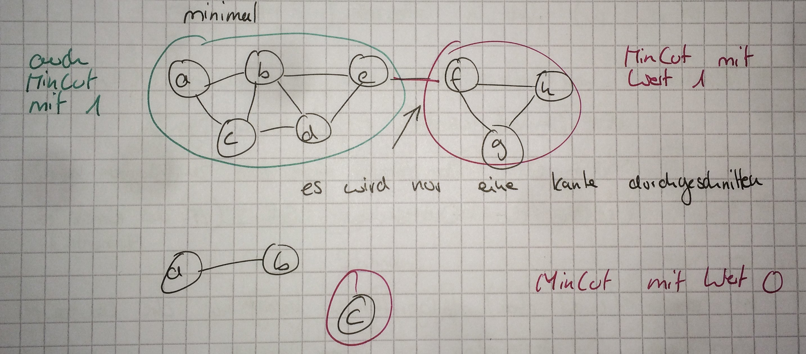
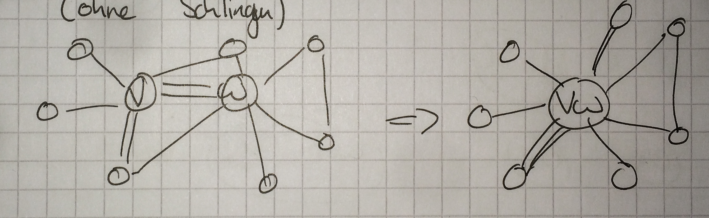
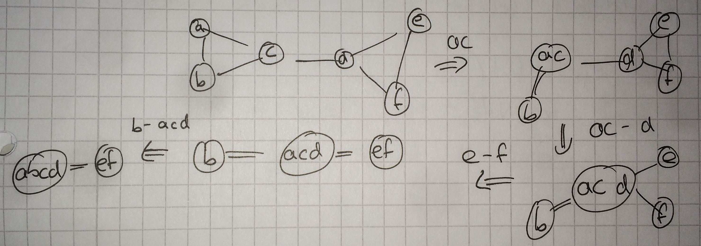
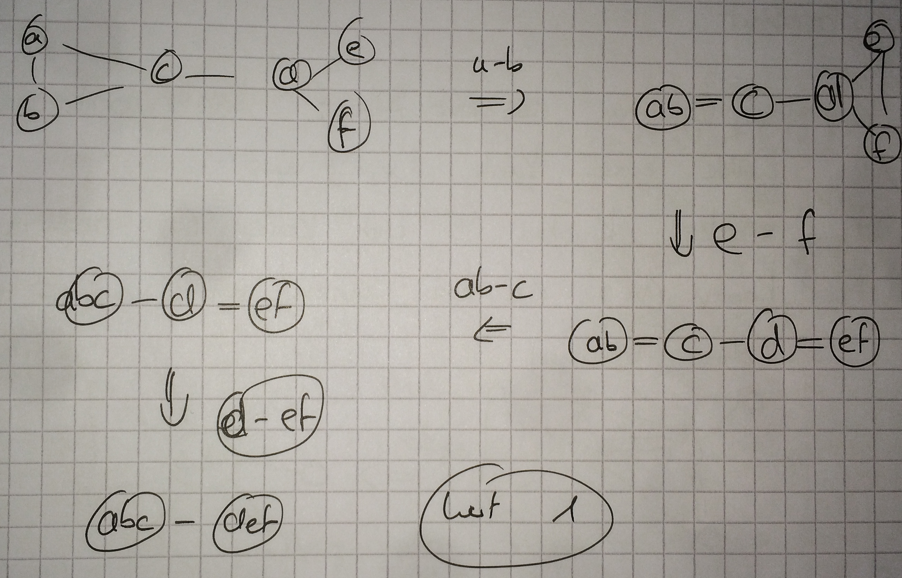

---

## 2. Vorlesung

## Randomiesierte inkrementelle Alogorithmen
### Zusammenfassung CP
* Bringe Punktmenge in zufällige Reihenfolge $p_1,...,p_n$
* Invariant bzgl:
  * $\delta_i :=$ Minimalabstand zweier Punkte in $\{p_1,...,p_i\}$
  * haben immer Gitterstruktur mit Maschenweite $\delta_i$, in welcher $p_1,...,p_i$ eingefügt sind.
* wichtigste Operation: Hinzunehmen von $p_{i+1}$ unter Aufrechterhaltung der Invarianten:
  * **Zusammen: $\mathcal {O}(1)$**
    * lokalisieren von $p_{i+1}$ in akt. Gitterstruktur $\rightarrow \mathcal {O}(1)$
    * Untersuchen der $\mathcal {O}(1)$ Punkte in den benachbarten Gitterzellen von $p_{i+1}$ auf Kandidat für Closest Pair $\rightarrow \mathcal {O}(1)$
* **$\mathcal {O}(1)$:** Fall A: $\delta_i \leq \delta_{i+1} \rightarrow$ $\delta_{i+1} = \delta_{i}$
      $\Rightarrow$ füge $p_{i+1}$ in Gitterstruktur
* **$\mathcal {O}(i)$:** Fall B: $\delta_i > \delta_{i+1}$
      $\Rightarrow$ baue neues Gitter mit Maschenweite $\delta_{i+1}$, füge $p_1,...,p_{i+1}$ ein

Schlechte Punktkonfiguration und Reihenfolge führt zu $\Theta(n^2)$ Laufzeit.
Idee: Betrachte Punkte in zufälliger Reihenfolge
$\Rightarrow$ Hoffnung: "Fall B" tritt zu selten auf

Die erwartete Laufzeit des Algorithmus ist
Laufzeit $=\sum_{i=3}^{n}$ (Kosten für Einfügen von Punkt $p_i$)

Erwartete Laufzeit = $E($ Laufzeit $)$

Weil $E(X_1+X_2) = E(X_1)+E(X_2) \Rightarrow$
$\sum_{i=3}^{n}E($ Laufzeit $)$

Fall A: $\mathcal{O}(1)$
Fall B: $\mathcal{O}(i)$
= WS für Fall A: $\mathcal{O}(1)$
+WS für Fall B: $\mathcal{O}(i)$
$\leq \mathcal{O}(1)$ + WS für Fall B: $\mathcal{O}(i)$

**Erklärung:** Fall B tritt ein, wenn $\delta_i < \delta_{i-1}$ d.h., wenn durch hinzufügen vpn $p_0$ sich die CP-Distanz ändert.

> $\delta_i < \delta_{i-1}$ kann nur passieren, wenn $p_i$ einer der beiden Punkte aus $\{ p_1, p_2, ... , p_i \}$ ist, welches das CP defniert.
Seien $p_a, p_b$ 2 Punkt aus $\{ p_1, p_2, ... , p_i \}$.
Fall B tritt ein, falls $p_i = p_a$ oder $p_i = p_b$
WS ist $\leq \tfrac{2}{i}$

Erwartete Laufzeit für Einfügen von $p_i$ ist $\leq \mathcal{O}(1)  \tfrac{2}{i} \cdot \mathcal{O}(i) = \mathcal{O}(1)$
$\Rightarrow$ erw. Gesamtlaufzeit: $\delta_z \sum^{n}_{i=3} \mathcal{O}(1) = \mathcal{O}(n)$

**Wichtig:**
Die Laufzeit des Algorithmus hängt _nicht_ von der Eingabe ab - sie ist immer erwartet $\mathcal{O}(n)$, egal wie die Eingabe aussieht.

Annamhe zur Gitterstruktur:
Angenommen wir haben Gitterstruktur mit Maschenweite $\delta$
$p(p_x,p_y)$ fällt in Gitterzelle $(\tfrac{p_x}{\lfloor \delta \rfloor}, \tfrac{p_y}{\lfloor \delta \rfloor})$
Annahme: Wir haben eine Datenstruktur, welche in $\mathcal{O}(1)$ ein Element in Zelle $(i,j)$ hinzufügen und in $\mathcal{O}(1)$ den Inhalt einer Zelle zurückgeben kann.
Größe der Datenstruktur soll $\mathcal{O}($ # der eingefügten Elemente $)$

Im obigen _(weit oben)_ Algorithmus hängt nur die Laufzeit vom Zufall ab, das Ergebnis ist immer korrekt.
$\Rightarrow$ LAS VEGAS ALGORITHMUS

Im Gegensatz dazu: **MONTE CARLO ALGORITHMEN**
* haben Laufzeit unabhängig vom Zufall
* Korrektheit des Ergebnisses hängt vom Zufall ab.

### MinCut-Problem
Lässt sich mit einem Monte Carlo (MC) Alg. lösen

Gegeben: ungerichteter, ungewichteter Multigraph mit $|V|=n$, $|E|=m$

Eine Teilmenge $A \subseteq V$ der Knoten induziert einen sogenannten **Cut**.

cut $(A,G)=\{e={v,w} \in E | {v,w} \cap A | = 1\}$
Der Wert des Cuts ist seine Kardnialität $|$ cut $(A,G)|$.

Das MinCut-Problem für einen Graphen $G(V,E)$:
Finde $A \subsetneq V$ mit $|$ cut $(A,G)|$ ist minimal:

Anmerkung: Minimalgrad eines Knotens in G ist immer die obere Schrnake für den Wert des MinCuts.

Anwendungen z.B.: Netzwerk & Fehlertoleranz; Stromnetze; Redundanzprüfung

#### Naiver Algorithmus
Teste alle möglichen Partitionen von $V$
$\sum^{n-1}_{i=1} {n \choose i} = 2^n-2$ für $n=|V|$
$\rightarrow$ aber nicht praktibal, da schon für einen Graph mit 128 Knoten mehr Partitionen möglich sind (340282366920938463463374607431768211456) als es Anzahl Atome im Universum gibt.
> Was zu beweisen wäre ~~~

#### Kargers MinCut Algorithmus
Randomisierter Algorithmus der mit WS ~$\tfrac{1}{n^2}$ das richtige Ergebnis berechnet.
**Zentrale Operation: Kantenkontraktion**
1. wähle eine Kante $\{v,w\}$ aus
2. ersetze Knoten $v$ und Kante $w$ durch Knoten $vw$ der alle Kanten von $v$ und $w$ erbt (ohne Schlingen).

##### Algorithmus
**for** $1$ to $n-2$ **do**:
&nbsp;&nbsp;&nbsp;&nbsp;&nbsp;&nbsp;&nbsp;&nbsp;Kontrahiere zufällige Kante
**rof**
Gib Kantenmenge entsprechend einen der beiden verbleibenden Knoten aus.

Annahme: Es gibt genau einen MinCut und dessen Wert ist K.

_Beobachtung:_ Alg. berechnet den MinCut $\Leftrightarrow$
In keiner der $n-2$ Kontraktionen wurde einer der K MinCut-Kanten kontrahiert.

Output $= \{e,f\}$ induziert Cut mit Wert 2.

Alternativer Ablauf:

