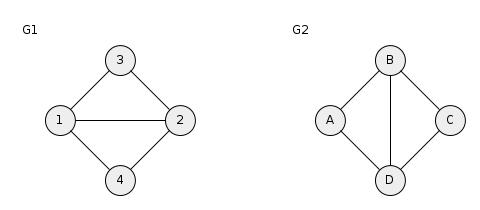
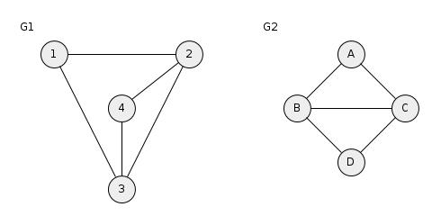
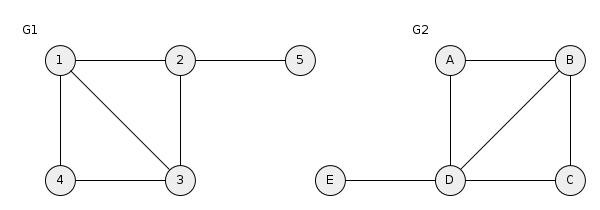

---

## 4. Vorlesung

Komplexität Randomisierter QuickSort
Laufzeit Randomisierter QuickSort

Mit hoher Wahrscheinlichkeit braucht Randomisierter Quicksort mit Wrapper $\leq 2n \cdot (log n) \cdot (log n) \leq 2n \cdot log^2 n$ Schritte.

Also $Pr (X > 2 \cdot n \cdot log^2 n) \leq \tfrac 1 n$

Zum Vergleich: Mit Markov-Ungleichung konnten wir zeigen:

$Pr(X > 2 \cdot n \cdot log^2 n) \leq \tfrac {1}{2 log n}$

Genauso gilt für Wrapper Algorithmus:

$Pr(X > 2 \cdot 5 \cdot n \cdot log^2 n) \leq \tfrac 1 {n^5}$

Hinweis: 5 is hier Exponent und Faktor.

### Zero-Knowledge-Proof

Anwendung: Online-Banking
Sie gehen auf die Webseite ihrer Bank. Wie können Sie sicher sein, welche auf deren Webseite zu sein und nicht auf dem Mockup ihres WG-Genossen, der ihre TANs abgraben will?

Ansatz: Die Bank soll ihnen beweisen, dass sie ein Geheimnis kennt, welches nur die Bank und Sie kennen kann, allerdings ohne das Geheimnis zu verraten.

In Cryptosprache:
Alice möchte Bob beweisen, dass sie ein Geheimnis kennt, ohne das Bob etwas über das Geheimnis lernt (Zero-Knowledge-Proof).

Gewünschte Eigenschaften des Protokolls:
- Falls Alice das Geheimnis nicht kennt, wird sie mit hoher Wahrscheinlichkeit von Bob ertappt.
- Alice gibt nichts preis, was Bob nicht sowieso schon weiß.

Protokoll besitzt auf dem Graphisomorphieproblem:

Geg: Graphen $G_1(V_1, E_1)$ und $G_2(V_2, E_2)$

Frage: Sind $G_1$ und $G_2$ isomorph?
$G_1$ und $G_2$ heißen isomorph zueinander falls $\exists$ eine Bijektion: $\phi : v_1 \rightarrow v_2$

Sodass $\forall (u, v) \in E_1 \Leftrightarrow (\phi (u), \phi(v)) \in E_2$

Beispiel 1:

Ja, sind isomorph, Beweis:

|$v$|$\phi(v)$|
|-|-|
|1|D|
|2|B|
|3|A|
|4|C|

Beispiel 2:

Nein, weil identische Anzahl Knoten und Kanten notwendig für Existens einer Isomorphie.

Beispiel 3:

Ja

|$v$|$\phi(v)$|
|-|-|
|1|A|
|2|C|
|3|B|
|4|D|

Beispiel 4:

Nein, da $G_2$ einen Grad-4-Knoten enthält und $G_1$ nicht.

Bislang gibt es keinen Polynomzerlegungsalgorithmus, der Graphenisomorphie entscheidet. NP-Hart ist nicht bekannt.

Geheim der Bank (Alice):
Isomorphismus zwischen zwei öffentlich bekannten Graphen $G_1$ und $G_2$.

Alice (Bank) möchte Bob (Sie) davon überzeugen, dass sie $\phi$ kennt, ohne $\phi$ zu verraten.

#### Setup (nur 1x):

Alice erzeugt zufällig einen riesigen Graph $G_1$ und durch zufällige Permutation der Knotenmenge (das ist der geheime Isomorphismus $\phi$) auch einen isomorphen Graph $G_2$.

$G_1$ und $G_2$ werden öffentlich gemacht, $\phi$ bleibt das Geheimnis von Alice.

#### Protokoll

Protokoll durch welches Alice Bob überzeugt, das Gehemnis zu kennen:

Alice permutiert G_j (mit $j \in \{1,2\}$ zufällig) mit einer zufälligen Permutation $\pi$ zu $H$ (und stellt sicher, dass $H \neq G_1 , G_2$) und schickt $H$ zu Bob.

Bob: Möchte sich davon überzeugen, dass Alice Isomorphie zwischen $G_1$ und $G_2$ kennt, indem er $k \in \{1,2\}$ zufällig wählt und Alice bittet, die Isomorphie zwischen $G_k$ und $H$ offenzulegen.

Alice: Zerlegt entweder $\pi$ (falls $j = k$) oder $pi \cdot \phi$ bzw. $pi \cdot \phi^{-1}$

Alice erzeugt $H$ aus $G_1$

BILD  
//TODO
Alice antwortet mit $\pi$, falls Bob $k=1$ sagt bzw. mit $\phi \cdot \phi^{-1}$ falls $k=2$.

Alice erzeugt $H$ aus $G_2$

Falls Bob $k=1$ sagt: $\pi \cdot \phi$

Falls Bob $k=2$ sagt: $\pi$

Falls Alice $\phi$ kennt, kann sie immer korrekt antworten.

Falls Alice $\phi$ nicht kennt und $H$ aus $G_1$ konstruiert hat, kann sie Bobs Anfrage nach Isomorphie zwischen $G_1$ und $H$ einfach beantworten, allerdings wird es Alice schwerfallen, eine Isomorphie zwischen $G_2$ und $H$ zurück zu geben, es sei den, sie kann das Graphisomorphieproblem lösen.

Theorem: Alice verrät nichts über $\phi$

Beweis: Bob lernt Isomorphie zwischen z.B. $G_1$ und einer zufälligen Permutation von $G_1$. Die Isomorphie hätte er sich auch selber basteln können.

Theorem: Bob bekommt probalisitischen Beweis, dass Alice $\phi$ kennt. Bei $f$-maliger Wiederholung ist Wahrscheinlichkeit, dass Bob immer den Graph $G_j$ wählt, den Alice zur Erzeugung des jeweiligen $H$ verwendet hat $\tfrac{1}{2^f}$.

Beweis:
//TODO
